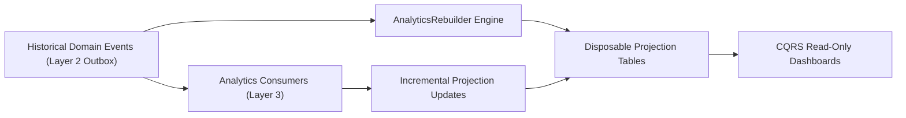
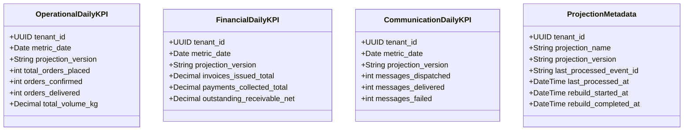

# ANALYTICS_SERVICE_DESIGN: CQRS Read Models & Disposable Rebuildable Projections (FROZEN)

## 1. Executive Summary & Core Identity

### Core Architectural Invariant
> **Analytics owns no business truth. Analytics is strictly a disposable read model.**

Traditional monolithic dashboards execute expensive aggregations (`COUNT`, `SUM`, `JOIN`) directly against transactional core tables (`orders`, `khata_ledger`, `inventory`), causing lock contention and database degradation. The **Go Chicken Analytics Domain (`AnalyticsService`)** strictly enforces the Command Query Responsibility Segregation (CQRS) pattern: analytical dashboards query **disposable read-only projection tables** populated asynchronously by Layer 3 event consumers.



---

## 2. Three Logical Projection Categories & Metadata Tracking

Projections are separated into three domain schemas plus operational tracking metadata:



---

## 3. CQRS Read Model Separation (ADR-0011)

Dashboards query projection tables only (`OperationalDailyKPI`, `FinancialDailyKPI`, `CommunicationDailyKPI`). They never execute analytical `SUM/GROUP BY` queries against Layer 1 transactional aggregates (`Order`, `KhataLedger`, `InventoryItem`).

---

## 4. Disposable Projection Rebuilder (`AnalyticsRebuilder`)

Because projections are deterministic derivations of historical events, any or all analytics tables can be truncated and reconstructed at any time:

```python
class AnalyticsRebuilder:
    """Reconstructs all analytical projection tables deterministically from historical events."""

    async def rebuild_all(self, db: AsyncSession, tenant_id: UUID) -> RebuildSummary:
        # 1. Truncate existing projections for tenant
        # 2. Query historical outbox / domain events ordered by occurred_at ASC
        # 3. Replay events sequentially through AnalyticsService
        ...
```

### Core Equivalence Theorem
$$\text{Incremental Updates}(E_1, E_2, \dots, E_n) \equiv \text{Full Rebuild}(\text{sort\_by\_occurred\_at}(E_1, E_2, \dots, E_n))$$
If incremental event consumption ever produces a balance or count that differs from a complete replay rebuild, it is classified as a critical architectural defect.

---

## 5. Replay-Safe Idempotency & Chronological Ordering

Every projection update tracks processed event IDs (`AnalyticsEventProcessed`) and orders out-of-order historical replays strictly by `occurred_at ASC`, guaranteeing deterministic state reconstruction.

---

## 6. Verification & 12 Test Categories for PR 9

PR 9 implementation is verified against 12 rigorous test categories:
1. **Projection Rebuild from Historical Events**: Complete reconstruction from raw events.
2. **Duplicate Event Replay (Idempotency)**: Replaying the same event 3 times yields zero double-counting.
3. **Projection Consistency After Replay**: Verifying exact field-by-field parity after duplicate replays.
4. **Daily Sales Aggregation**: `total_orders_placed` and `total_volume_kg` calculation.
5. **Inventory Movement Aggregation**: Stock allocation and delivery volume tracking.
6. **Communication Success Metrics**: Dispatch, delivery, and failure rate calculation.
7. **Financial KPI Calculations**: Daily invoice totals vs daily collections.
8. **Multi-Tenant Isolation**: Ensuring zero analytical cross-talk between tenants.
9. **Incremental Projection Updates**: Synchronous real-time updates via Layer 3 consumer.
10. **Full Rebuild Equivalence Theorem**: Proving $\text{Incremental} == \text{Full Rebuild}$.
11. **Projection Deletion Recovery**: Deleting projection table and restoring 100% via `AnalyticsRebuilder`.
12. **Out-of-Order Replay Guarantee**: Processing `E3 -> E1 -> E2` chronologically sorted by `occurred_at ASC`.
