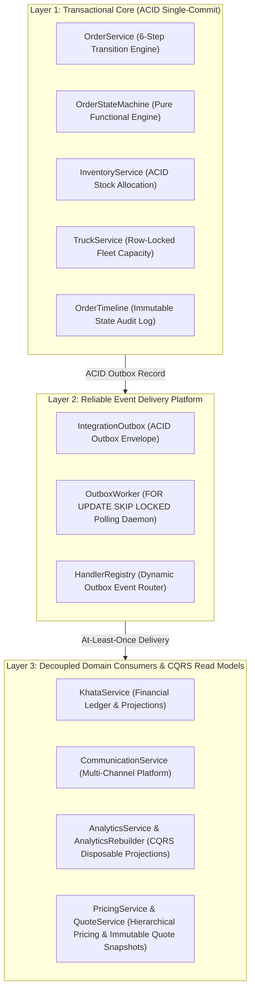

# Go Chicken Enterprise Platform — Architectural Governance Index

This index serves as the definitive entry point for architects and engineers navigating the Go Chicken enterprise platform. Every major architectural decision is recorded in an Architecture Decision Record (ADR) and governed by strict layer boundaries.

---

## 1. Enterprise Layer Architecture



---

## 2. Architecture Decision Records (ADRs)

| ADR | Title | Decision Summary | Architectural Layer | Status |
| :---: | :--- | :--- | :---: | :---: |
| [`0001`](file:///d:/Go%20Chicken/docs/adr/0001-order-orchestrator.md) | **Order Orchestrator Architecture** | `OrderService` acts as the single transactional orchestrator for order transitions. | Layer 1 | ✅ Frozen |
| [`0002`](file:///d:/Go%20Chicken/docs/adr/0002-state-machine.md) | **Pure Functional State Machine** | `OrderStateMachine` performs stateless, pure functional transition validation. | Layer 1 | ✅ Frozen |
| [`0003`](file:///d:/Go%20Chicken/docs/adr/0003-transaction-boundary.md) | **Single ACID Commit Boundary** | Order status, inventory allocation, and outbox event are committed in 1 DB transaction. | Layer 1 | ✅ Frozen |
| [`0004`](file:///d:/Go%20Chicken/docs/adr/0004-transactional-outbox.md) | **Transactional Outbox Pattern** | Guaranteed event delivery via ACID outbox persistence prior to commit. | Layer 2 | ✅ Frozen |
| [`0005`](file:///d:/Go%20Chicken/docs/adr/0005-outbox-worker.md) | **Outbox Worker Polling Daemon** | Concurrency-safe outbox delivery via `SELECT ... FOR UPDATE SKIP LOCKED`. | Layer 2 | ✅ Frozen |
| [`0006`](file:///d:/Go%20Chicken/docs/adr/0006-handler-registry.md) | **Dynamic Handler Registry** | Decoupled event consumer registration via `HandlerRegistry.register(event_type, handler)`. | Layer 2 | ✅ Frozen |
| [`0007`](file:///d:/Go%20Chicken/docs/adr/0007-immutable-financial-ledger.md) | **Immutable Financial Ledger** | Financial source of truth is append-only `KhataLedger`; balance is a rebuildable projection. | Layer 3 | ✅ Frozen |
| [`0008`](file:///d:/Go%20Chicken/docs/adr/0008-communication-provider-abstraction.md) | **Communication Provider Abstraction** | Multi-channel messaging (`WHATSAPP`, `SMS`) decoupled via abstract `CommunicationProvider`. | Layer 3 | ✅ Frozen |
| [`0009`](file:///d:/Go%20Chicken/docs/adr/0009-template-based-communication.md) | **Centralized Template Registry** | Decouples customer copy from event handlers via `TemplateRegistry` & strict parameter validation. | Layer 3 | ✅ Frozen |
| [`0010`](file:///d:/Go%20Chicken/docs/adr/0010-rebuildable-analytics-projections.md) | **Rebuildable Analytics Projections** | Analytics tables are strictly disposable read models reconstructable via `AnalyticsRebuilder`. | Layer 3 | ✅ Frozen |
| [`0011`](file:///d:/Go%20Chicken/docs/adr/0011-cqrs-read-model-separation.md) | **CQRS Read Model Separation** | Dashboards read exclusively from projections and never query transactional core tables. | Layer 3 | ✅ Frozen |
| [`0012`](file:///d:/Go%20Chicken/docs/adr/0012-immutable-quote-snapshots.md) | **Immutable Quote Snapshots** | Freezes line-item unit prices and resolution provenance inside immutable `Quote` & `QuoteItem` records. | Layer 3 | ✅ Frozen |
| [`0013`](file:///d:/Go%20Chicken/docs/adr/0013-hierarchical-price-resolution.md) | **Hierarchical Price Resolution** | Evaluates pricing deterministically: `CUSTOMER_OVERRIDE -> TIER_PRICEBOOK -> BASE_PRICEBOOK`. | Layer 3 | ✅ Frozen |

---

## 3. Platform Pillars & Maturity Status

### ✅ Pillar 1: Platform Infrastructure (PR 1–6)
* **ACID Transactional Core**: Deterministic 6-step lifecycle (`pending -> confirmed -> loading -> out_for_delivery -> delivered -> settled`).
* **Reliable Event Engine**: Guaranteed asynchronous delivery via Transactional Outbox and skip-locked worker polling.

### ✅ Pillar 2: Financial Domain (`KhataService` — PR 7)
* **Immutable Source of Truth**: Append-only journal entries (`INVOICE`, `PAYMENT`, `CREDIT_NOTE`, `ADJUSTMENT`) with database unique idempotency index.
* **FIFO Payment Allocation**: Oldest unpaid invoices settled first automatically.
* **Deterministic Rebuild**: Customer balance projections can be rebuilt 100% from raw ledger history.

### ✅ Pillar 3: Communication Domain (`CommunicationService` — PR 8)
* **Multi-Channel Platform**: Dynamic provider routing (`WhatsAppProvider`, `SMSProvider`) with automatic fallback (`WHATSAPP -> SMS`).
* **Centralized Template Engine**: Decouples message copy from event consumers with strict variable validation.

### ✅ Pillar 4: Analytics Domain (`AnalyticsService` — PR 9)
* **CQRS Read Model Invariant**: Analytics owns no business truth and never acts as a source of truth.
* **Equivalence Theorem**: $\text{Incremental Updates} \equiv \text{Full Rebuild}$.
* **Versioned Projections & Metadata**: Traces processing progress (`ProjectionMetadata`) and supports schema evolution (`projection_version`).

### ✅ Pillar 5: Pricing & Quote Engine (`PricingService` & `QuoteService` — PR 10)
* **Deterministic Resolution Hierarchy**: Precedence resolution (`CUSTOMER_OVERRIDE -> TIER_PRICEBOOK -> BASE_PRICEBOOK`) with explicit `pricing_source` provenance auditability.
* **Immutable Quote Snapshots**: Freezes unit rates and surcharges inside versioned `Quote` (`quote_version = 1`) and `QuoteItem` rows.
* **ACID Quote-to-Order Conversion**: Converts `APPROVED` quotes transactionally into orders via `QuoteConvertedIntegrationEvent`.

---

## 4. Test Suite Progression Summary

```text
73 tests (Legacy CRUD)
 ↓
79 tests (State Machine & Timeline — PR 1 & 2)
 ↓
85 tests (OrderService 6-Step Engine — PR 3)
 ↓
91 tests (Inventory & Truck ACID Integration — PR 4)
 ↓
95 tests (Transactional Outbox Persistence — PR 5)
 ↓
111 tests (Outbox Worker Daemon & Registry — PR 6)
 ↓
121 tests (Financial Ledger & FIFO Accounting — PR 7)
 ↓
133 tests (Multi-Channel Communication Platform — PR 8)
 ↓
145 tests (CQRS Read Models & Disposable Analytics Projections — PR 9)
 ↓
157 tests (Enterprise Pricing & Immutable Quote Engine — PR 10)
```
Every enterprise subsystem arrives with comprehensive automated regression coverage (**157 / 157 passing unit tests**).
