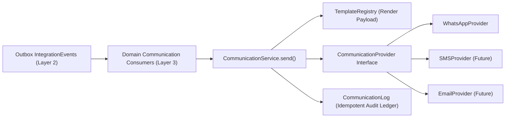
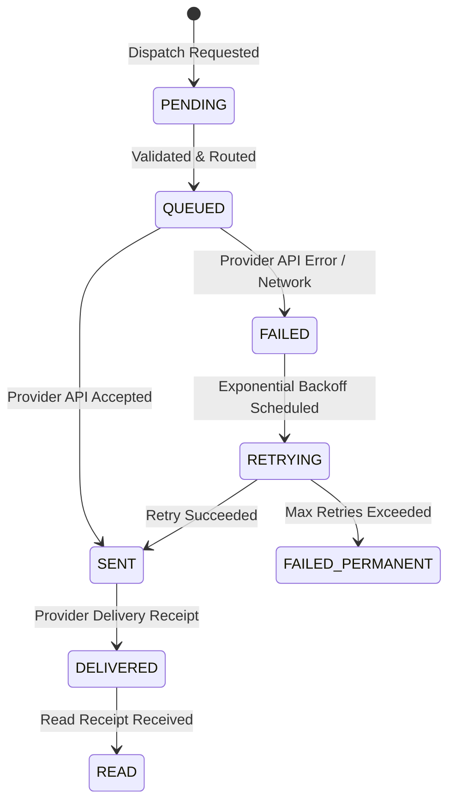

# COMMUNICATION_SERVICE_DESIGN: Multi-Channel Communication Platform Architecture

## 1. Executive Summary & Core Identity

### Why a "Communication Platform" instead of a Notification Service?
Narrow notification services inevitably degenerate into ad-hoc procedural scripts (`if channel == 'whatsapp': ... elif channel == 'sms': ...`). The **Go Chicken Communication Platform (`CommunicationService`)** models customer communication as a first-class enterprise domain with abstract channel providers, template-driven rendering, strict delivery auditing, and replay-safe idempotency.



---

## 2. Decoupled Layer 3 Consumer Integration

Communication is strictly a **consumer** of domain events. Neither `OrderService` nor `KhataService` has any dependency on or knowledge of communication channels.

### Domain Event to Template Mapping Table
| Domain Integration Event | Communication Consumer | Template ID | Default Channel |
| :--- | :--- | :--- | :--- |
| `OrderConfirmedIntegrationEvent` | `OrderConfirmedCommunicationConsumer` | `ORDER_CONFIRMED` | `WHATSAPP` |
| `OrderLoadedIntegrationEvent` | `OrderLoadedCommunicationConsumer` | `ORDER_LOADED` | `WHATSAPP` |
| `OrderOutForDeliveryIntegrationEvent` | `OrderOutForDeliveryCommunicationConsumer` | `ORDER_OUT_FOR_DELIVERY` | `WHATSAPP` |
| `OrderDeliveredIntegrationEvent` | `OrderDeliveredCommunicationConsumer` | `ORDER_DELIVERED` | `WHATSAPP` |
| `OrderInvoiceGeneratedIntegrationEvent` | `InvoiceGeneratedCommunicationConsumer` | `INVOICE_GENERATED` | `WHATSAPP` |
| `PaymentReceivedIntegrationEvent` | `PaymentReceivedCommunicationConsumer` | `PAYMENT_RECEIVED` | `WHATSAPP` |
| `CustomerOverdueIntegrationEvent` | `CustomerOverdueCommunicationConsumer` | `PAYMENT_OVERDUE` | `WHATSAPP` |

---

## 3. Abstract Provider Interface (`CommunicationProvider`) & Channel Preferences

All communication channels must adhere to a strict asynchronous contract:

```python
class CommunicationProvider(ABC):
    """Abstract interface for multi-channel communication providers."""

    @property
    @abstractmethod
    def channel(self) -> str:
        """Return canonical channel identifier (e.g., 'WHATSAPP', 'SMS', 'EMAIL')."""
        pass

    @abstractmethod
    async def send(
        self,
        recipient: str,
        content: str,
        metadata: Dict[str, Any],
    ) -> ProviderDeliveryResult:
        """Dispatch message payload via underlying channel API."""
        pass
```

### Channel Preference Resolution Hierarchy (Future Policy)
When routing a communication request, channels resolve according to:
`Customer Preference -> Tenant Default -> System Default ('WHATSAPP')`

---

## 4. Template Engine & Content Rendering (`TemplateRegistry`)

Messages are never hardcoded inside consumers. Instead, `CommunicationService` resolves structured templates:

```python
@dataclass(frozen=True)
class CommunicationTemplate:
    template_id: str
    channel: str
    subject_template: Optional[str]
    body_template: str

    def render(self, context: Dict[str, Any]) -> str:
        # Raises typed TemplateRenderingError if required context keys are missing
        ...
```

---

## 5. Delivery Status Lifecycle & State Machine

Every communication request is tracked inside an immutable-entry audit table (`CommunicationLog`).

*(Future Evolution Note: To model multiple provider webhook callbacks for a single dispatched message, `CommunicationLog` can spawn append-only `DeliveryReceipt` child entries tracking granular provider webhooks (`QUEUED -> SENT -> DELIVERED -> READ`).)*



---

## 6. Strict Idempotency & Replay Protection

Because `OutboxWorker` guarantees at-least-once event delivery, `CommunicationService` enforces strict database-level idempotency:

```python
async def send(
    db: AsyncSession,
    tenant_id: UUID,
    recipient: str,
    template_id: str,
    context: Dict[str, Any],
    idempotency_key: str,  # Typically event_id
    channel: str = "WHATSAPP",
) -> CommunicationLog:
    existing = await get_log_by_idempotency_key(db, tenant_id, idempotency_key)
    if existing:
        logger.info(f"[COMMUNICATION IDEMPOTENT] Duplicate dispatch {idempotency_key} ignored.")
        return existing
    ...
```

Database Unique Constraint: `UNIQUE(tenant_id, idempotency_key)` prevents duplicate messages.

---

## 7. Verification & 12 Test Categories for PR 8

PR 8 implementation will be verified against 12 comprehensive test categories:
1. **Provider Selection & Dynamic Routing**: Resolving `WHATSAPP` vs `SMS` provider from registry.
2. **Template Rendering**: Parameterized variable formatting (`{order_number}`, `{amount}`).
3. **Template Validation Error**: Missing required template variables raises typed `TemplateRenderingError`.
4. **Duplicate Event Suppression**: Replaying an integration event 3 times sends exactly **1** message.
5. **Retry Scheduling**: Transitioning from `FAILED -> RETRYING`.
6. **Permanent Failure Handling**: Transitioning to `FAILED_PERMANENT` after max retries.
7. **Provider Timeout / Error Handling**: Resilient handling of provider API timeouts.
8. **Unsupported Channel Rejection**: Raising typed `UnsupportedChannelError` when channel is missing.
9. **Multi-Channel Dispatch**: Dispatching same notification event across multiple registered channels.
10. **Delivery Status Transitions**: Validating lifecycle progress (`PENDING -> QUEUED -> SENT -> DELIVERED -> READ`).
11. **Provider Failure with Fallback**: Verification of multi-provider fallback strategy.
12. **Layer 3 Consumer Integration**: End-to-end simulation of `OrderDeliveredIntegrationEvent -> Consumer -> CommunicationService -> WhatsAppProvider`.
