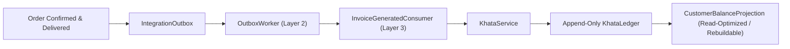
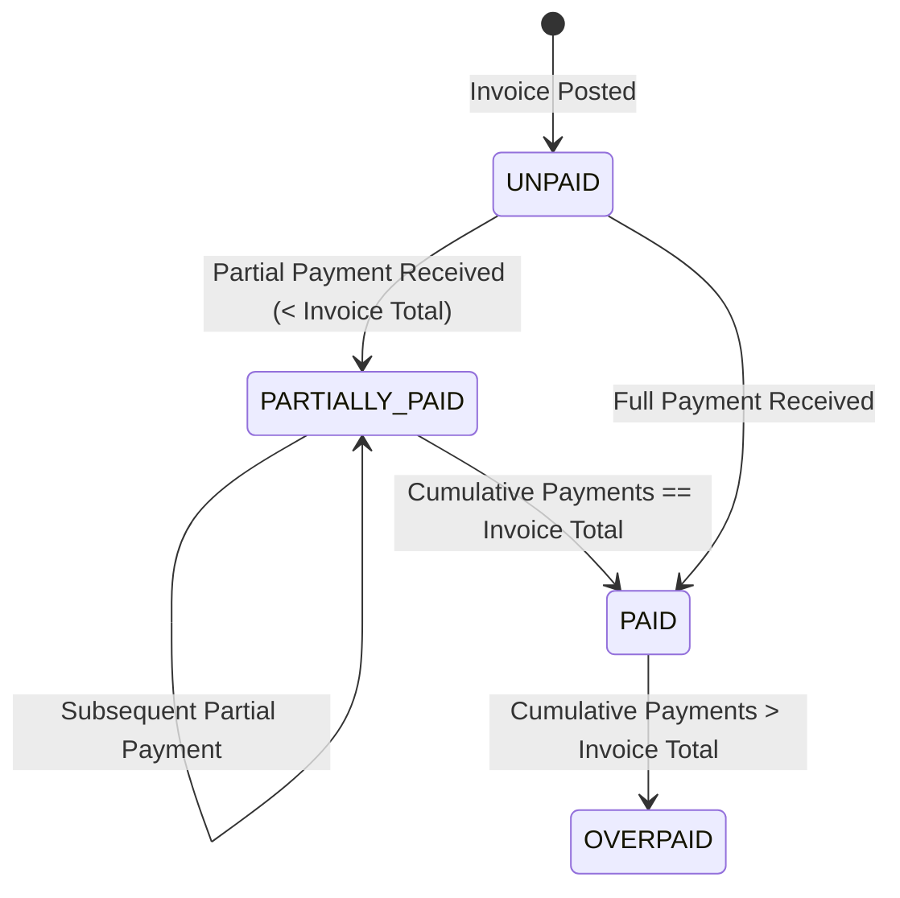

# KHATA_SERVICE_DESIGN: Financial Source of Truth & Immutable Ledger Architecture

## 1. Executive Summary & Core Identity

### What is Khata?
Khata (`KhataService`) is the **Financial Source of Truth** for the Go Chicken platform. It models the financial lifecycle between Go Chicken (Wholesaler) and its B2B customers (Retailers/Restaurants).



---

## 2. Separation of Immutable Ledger & Rebuildable Balance Projection

To ensure accounting rigor, Khata separates the immutable journal from read-optimized balance projections:

1. **`KhataLedger` (Immutable Source of Truth)**:
   - Strictly append-only accounting ledger.
   - Rows are **never updated or deleted**.
2. **`CustomerBalanceProjection` (Read-Optimized Projection)**:
   - Maintains real-time cached balance and aging metrics.
   - **Synchronous Refresh Strategy**: Whenever a new `KhataLedger` row is appended by `KhataService`, `CustomerBalanceProjection` is updated **synchronously within the same ACID database transaction**. This guarantees real-time balance accuracy while preserving append-only auditability.
   - **Rebuildable Invariant**: At any instant, `CustomerBalanceProjection.outstanding_balance` must equal `∑(Ledger Debits) - ∑(Ledger Credits)`. If projection drift ever occurs, it can be deterministically rebuilt from `KhataLedger`.

---

## 3. Fundamental Financial Invariants & `Decimal`-Only Precision

### Mathematical Invariant
```text
Outstanding Balance = ∑(Invoices) - ∑(Payments) - ∑(Credit Notes) + ∑(Debit Notes)
```

> [!CAUTION]
> **Strict `Decimal`-Only Financial Arithmetic**: Floating-point arithmetic (`float`) is **strictly forbidden** across all financial attributes, database columns (`Numeric(12, 2)`), API schemas, and internal calculations. Python `Decimal` with explicit rounding policies must be used universally.

---

## 4. Append-Only Ledger Trail & Polymorphic References

Instead of rigid single-table coupling, `KhataLedger` entries use a polymorphic reference model (`reference_type` + `reference_id`), decoupling business documents (`Invoice`) from accounting ledger lines (`LedgerEntry`).

### Ledger Entry Types (`EntryType`)
| Entry Type | Signed Balance Impact | Description |
| :--- | :---: | :--- |
| `INVOICE` | **+ (Debit / Receivable)** | Posted automatically when an order invoice is generated |
| `PAYMENT` | **- (Credit / Received)** | Posted when cash, UPI, or bank transfer settlement is recorded |
| `CREDIT_NOTE` | **- (Credit / Reduction)** | Posted for returns, damages, or goodwill discounts |
| `DEBIT_NOTE` | **+ (Debit / Increase)** | Posted for underbilling corrections or surcharge additions |
| `ADJUSTMENT` | **+/- (Signed Adjustment)** | Posted for manual reconciliations or bad-debt write-offs |
| `REVERSAL` | **+/- (Opposite of Target)** | Non-destructive reversal of an erroneous prior posting |

### Polymorphic Ledger Reference (`reference_type`)
Supported reference types: `ORDER`, `INVOICE`, `PAYMENT`, `RETURN`, `ADJUSTMENT`.

---

## 5. Payment Allocation Policy (FIFO / Oldest Invoice First)

When a customer makes a lump-sum payment (`PAYMENT` ledger posting) without explicit invoice allocation:
* **FIFO Policy**: `KhataService` automatically allocates settlement funds against the **oldest unpaid or partially paid invoice first** (ordered by `invoice.issued_at ASC`).
* Remaining surplus after settling oldest invoices transitions into credit or applies to subsequent invoices.

---

## 6. Multi-Payment & Invoice Settlement Lifecycle

Every business `Invoice` document tracks its settlement across multiple partial or full payments:



---

## 7. Strict Exactly-Once Delivery Guarantee via Idempotency

To prevent duplicate financial postings when `OutboxWorker` replays events after process restarts:

```python
async def post_invoice(
    db: AsyncSession,
    tenant_id: UUID,
    customer_id: UUID,
    invoice_id: UUID,
    amount: Decimal,
    idempotency_key: str,  # Outbox event_id
) -> LedgerEntry:
    # Database unique constraint UNIQUE(tenant_id, idempotency_key) guarantees single posting
    ...
```

---

## 8. Consumer Architecture (`InvoiceGeneratedConsumer`)

```python
class InvoiceGeneratedConsumer(EventHandler):
    """Layer 3 event consumer translating outbox envelopes into financial ledger postings."""
    async def handle(self, event: IntegrationEvent) -> None:
        async with session_factory() as db:
            await KhataService.post_invoice(
                db=db,
                tenant_id=event.tenant_id,
                customer_id=UUID(event.payload["customer_id"]),
                invoice_id=UUID(event.payload["order_id"]),
                amount=Decimal(str(event.payload["total_amount"])),
                idempotency_key=str(event.event_id),
            )
```

---

## 9. Exhaustive Verification & Test Plan for PR 7

PR 7 (`KhataService`) will be tested against 8 rigorous financial test categories:
1. **Partial Payment Accumulation**: `1000 -> 400 -> 300 -> 300 == PAID`.
2. **Overpayment Tracking**: `1000 -> 1200 == OVERPAID (Credit Balance = 200)`.
3. **Credit Note Application**: `Invoice 1000 -> Credit 200 == Outstanding 800`.
4. **Duplicate Event Idempotency**: Replaying `InvoiceGenerated` 4 times produces exactly **1** ledger row.
5. **Concurrent Duplicate Event**: Two workers concurrently handling the same `idempotency_key` create exactly **1** ledger row due to `UNIQUE(tenant_id, idempotency_key)`.
6. **Multi-Invoice FIFO Allocation**: `Invoice A: 1000`, `Invoice B: 2000`, `Payment: 1500` -> `Invoice A == PAID`, `Invoice B == PARTIALLY_PAID (1500 outstanding)`.
7. **Adjustments & Non-Destructive Reversals**: Zeroing balance via `ADJUSTMENT` or reversing wrong entry via `REVERSAL`.
8. **Projection Rebuild Verification**: Rebuilding `CustomerBalanceProjection` from raw `KhataLedger` rows yields exact parity.
