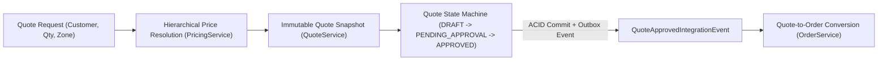
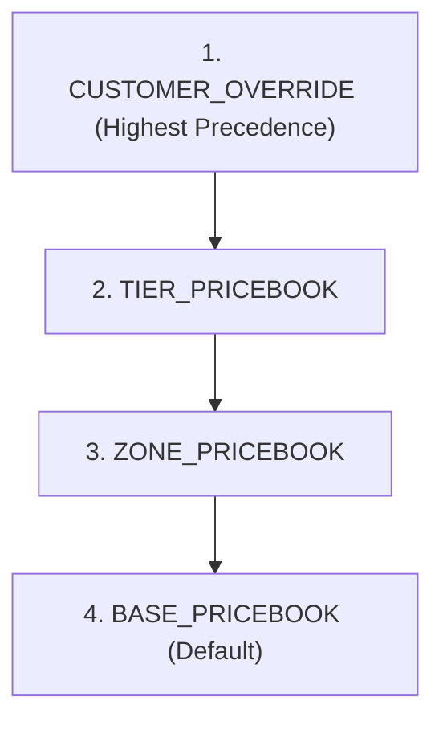
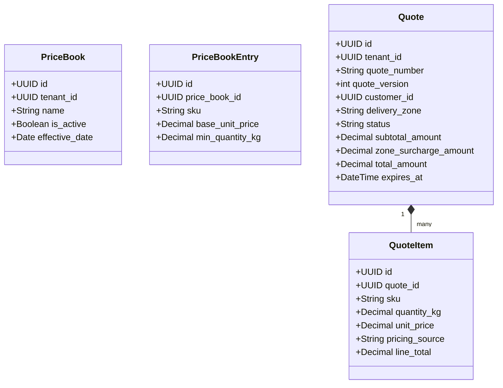
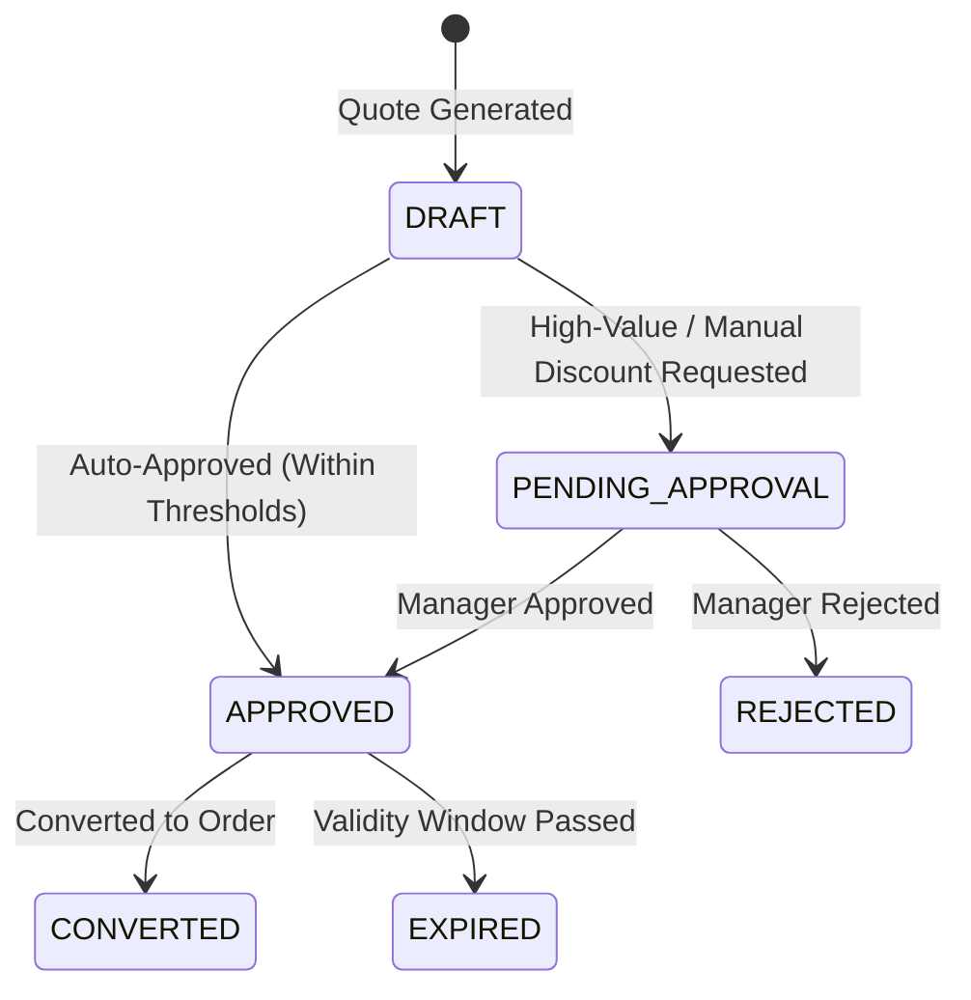

# PRICING_QUOTE_SERVICE_DESIGN: Enterprise Pricing & Quote Engine (FROZEN)

## 1. Executive Summary & Core Identity

### Why an Enterprise Pricing & Quote Engine?
B2B poultry and livestock supply chains operate on volatile daily wholesale rates, tier discounts, route/zone logistics surcharges, and negotiated customer contracts. Hardcoding unit prices into orders or updating a mutable `products.price` column creates historical pricing drift and billing disputes.

The **Go Chicken Pricing & Quote Engine (`PricingService` & `QuoteService`)** models pricing as a deterministic hierarchical engine and quotes as **immutable financial snapshots** with explicit approval workflows prior to order conversion.

---

## 2. Hierarchical Price Resolution Policy & Provenance (ADR-0013)

When generating a quote for a customer and delivery zone, `PricingService` resolves unit pricing deterministically using a strict precedence hierarchy and explicitly records the **provenance (`pricing_source`)**:

$$\text{Final Unit Price} = \text{Base/Tier Price} + \text{Zone Surcharge} - \text{Negotiated Discount}$$
*(All price calculations strictly use `Decimal` with rounding enforced to 2 decimal places).*

---

## 3. Immutable Quote Snapshots & Resolution Provenance (ADR-0012)

Once a quote is generated, its calculated unit price, zone surcharge, total amount, and resolution provenance are **frozen inside an immutable snapshot (`Quote` & `QuoteItem`)**.

---

## 4. Quote Approval State Machine & Lifecycle

Quotes progress through a deterministic, pure-functional state machine:

---

## 5. Quote-to-Order Transactional Conversion

When a customer accepts an `APPROVED` quote, `QuoteService.convert_to_order()` executes within a single ACID transaction boundary:
1. Validates that `Quote.status == APPROVED` and `datetime.now(utc) <= Quote.expires_at`.
2. Transitions `Quote.status = CONVERTED`.
3. Publishes an ACID outbox event (`QuoteConvertedIntegrationEvent`) carrying the exact snapshotted quote items and pricing to `OrderService`.

---

## 6. Verification & 12 Test Categories for PR 10

PR 10 implementation will be verified against 12 comprehensive test categories:
1. **Hierarchical Price Resolution Precedence**: Customer override vs tier vs base price book.
2. **Zone Logistics Surcharge Calculation**: Adding route/zone delivery surcharge to base rate.
3. **Immutable Quote Snapshot Parity**: Changing active price book after quote generation does not alter snapshotted quote price.
4. **Quote Auto-Approval vs Pending Approval**: Threshold-based transition to `APPROVED` or `PENDING_APPROVAL`.
5. **Expired Quote Rejection**: Attempting to convert an expired quote raises typed `QuoteExpiredError`.
6. **ACID Quote-to-Order Conversion**: Single transaction updating quote status and publishing `QuoteConvertedIntegrationEvent`.
7. **Append-Only Price Book Audit Trail**: Recording rate changes in `PriceHistory`.
8. **Decimal Precision & Rounding Invariants**: Zero floating-point drift across multi-item quotes.
9. **Duplicate Quote Conversion Idempotency**: Re-converting the same quote returns existing order reference.
10. **Multi-Tenant Price Book Isolation**: Ensuring zero cross-tenant pricing leakage.
11. **Resolution Provenance Auditability**: Verifying `QuoteItem.pricing_source` accurately records `"CUSTOMER_OVERRIDE"` vs `"TIER_PRICEBOOK"` vs `"BASE_PRICEBOOK"`.
12. **Quote Version Compatibility**: Verifying `quote_version = 1` is persisted and preserved across quote lifecycle states.
