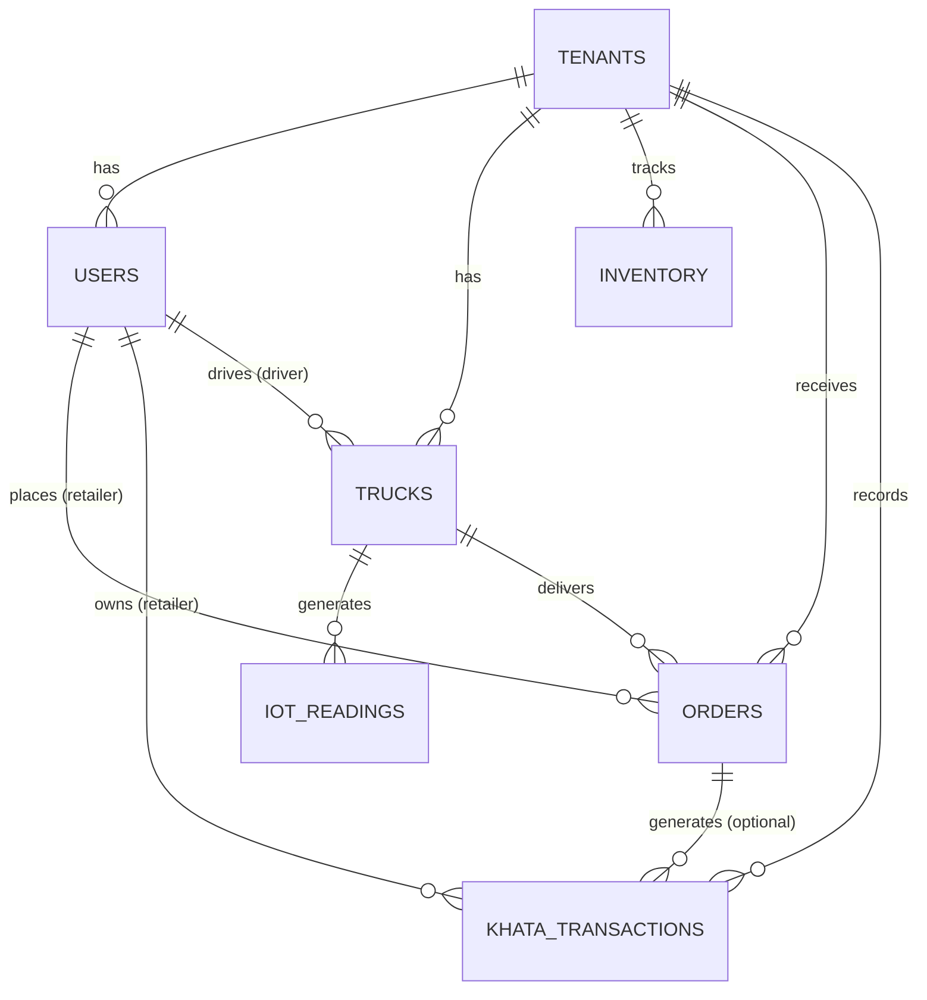

# Go Chicken - Database Schema & Architecture Plan

This document outlines the foundational PostgreSQL schema to support the **Go Chicken** multi-tenant SaaS architecture, including robust support for the Khata credit ledger, IoT temperature tracking, and `pgvector` for AI forecasting.

## Status: Approved
The schema has been reviewed and revised. The `users`, `trucks`, `orders`, and `ai_forecasts` tables have been updated with GPS tracking, truck capacities, item types, and optimized 768-dimensional embeddings for local Ollama models.

---

## 1. Entity-Relationship Diagram



---

## 2. PostgreSQL DDL Schema

### Core Multi-Tenancy & Users
```sql
-- 1. Tenants (Wholesalers)
CREATE TABLE tenants (
    id UUID PRIMARY KEY DEFAULT gen_random_uuid(),
    name VARCHAR(255) NOT NULL,
    created_at TIMESTAMP WITH TIME ZONE DEFAULT CURRENT_TIMESTAMP
);

-- 2. Users (Wholesaler Admins, Drivers, Retailers)
CREATE TYPE user_role AS ENUM ('admin', 'driver', 'retailer');

CREATE TABLE users (
    id UUID PRIMARY KEY DEFAULT gen_random_uuid(),
    tenant_id UUID REFERENCES tenants(id) ON DELETE CASCADE,
    role user_role NOT NULL,
    name VARCHAR(255) NOT NULL,
    phone VARCHAR(20) UNIQUE NOT NULL,
    whatsapp_id VARCHAR(255) UNIQUE,
    password_hash VARCHAR(255), -- Keep for Admins/Wholesalers only
    
    -- New Fields for Retailer Routing
    shop_address TEXT,
    latitude NUMERIC(10, 8),
    longitude NUMERIC(11, 8),
    
    created_at TIMESTAMP WITH TIME ZONE DEFAULT CURRENT_TIMESTAMP
);
```

### Logistics & IoT Tracking
```sql
-- 3. Trucks & IoT Devices
CREATE TABLE trucks (
    id UUID PRIMARY KEY DEFAULT gen_random_uuid(),
    tenant_id UUID REFERENCES tenants(id) ON DELETE CASCADE,
    driver_id UUID REFERENCES users(id) ON DELETE SET NULL,
    license_plate VARCHAR(50) NOT NULL,
    iot_device_id VARCHAR(100) UNIQUE,
    
    -- New Field for Dispatch Logic
    max_capacity_kg NUMERIC(10,2) NOT NULL DEFAULT 1000.00,
    
    created_at TIMESTAMP WITH TIME ZONE DEFAULT CURRENT_TIMESTAMP
);

-- 4. IoT Temperature Logs (Time-Series)
CREATE TABLE iot_readings (
    id UUID PRIMARY KEY DEFAULT gen_random_uuid(),
    truck_id UUID REFERENCES trucks(id) ON DELETE CASCADE,
    temperature NUMERIC(5,2) NOT NULL,
    recorded_at TIMESTAMP WITH TIME ZONE NOT NULL,
    alert_triggered BOOLEAN DEFAULT FALSE -- Flagged if temp > safe threshold
);
CREATE INDEX idx_iot_truck_time ON iot_readings(truck_id, recorded_at DESC);
```

### Inventory & Order Management
```sql
-- 5. Inventory (Stock & Mortality Tracking)
CREATE TABLE inventory (
    id UUID PRIMARY KEY DEFAULT gen_random_uuid(),
    tenant_id UUID REFERENCES tenants(id) ON DELETE CASCADE,
    bird_type VARCHAR(100),
    quantity_kg NUMERIC(10,2) NOT NULL DEFAULT 0,
    mortality_kg NUMERIC(10,2) NOT NULL DEFAULT 0, -- Dead stock tracking
    last_updated TIMESTAMP WITH TIME ZONE DEFAULT CURRENT_TIMESTAMP
);

-- 6. Orders
CREATE TYPE order_status AS ENUM ('pending', 'confirmed', 'in_transit', 'delivered', 'cancelled');

CREATE TABLE orders (
    id UUID PRIMARY KEY DEFAULT gen_random_uuid(),
    tenant_id UUID REFERENCES tenants(id) ON DELETE CASCADE,
    retailer_id UUID REFERENCES users(id) ON DELETE CASCADE,
    truck_id UUID REFERENCES trucks(id) ON DELETE SET NULL,
    status order_status DEFAULT 'pending',
    
    -- New Field to differentiate stock
    item_type VARCHAR(50) DEFAULT 'Live Bird', 
    
    quantity_kg NUMERIC(10,2) NOT NULL,
    price_per_kg NUMERIC(10,2) NOT NULL,
    total_amount NUMERIC(12,2) NOT NULL,
    delivery_date DATE NOT NULL,
    created_at TIMESTAMP WITH TIME ZONE DEFAULT CURRENT_TIMESTAMP,
    updated_at TIMESTAMP WITH TIME ZONE DEFAULT CURRENT_TIMESTAMP
);
```

### Finance (Khata Ledger)
```sql
-- 7. Khata (Digital Ledger for Retailers)
CREATE TYPE transaction_type AS ENUM ('charge', 'payment', 'adjustment');

CREATE TABLE khata_transactions (
    id UUID PRIMARY KEY DEFAULT gen_random_uuid(),
    tenant_id UUID REFERENCES tenants(id) ON DELETE CASCADE,
    retailer_id UUID REFERENCES users(id) ON DELETE CASCADE,
    order_id UUID REFERENCES orders(id) ON DELETE SET NULL, -- Null for standalone payments
    type transaction_type NOT NULL,
    amount NUMERIC(12,2) NOT NULL,
    balance_after NUMERIC(12,2) NOT NULL, -- Running balance for performance
    reference_note TEXT, -- e.g., "UPI Payment", "Mortality Adjustment"
    created_at TIMESTAMP WITH TIME ZONE DEFAULT CURRENT_TIMESTAMP
);
CREATE INDEX idx_khata_retailer ON khata_transactions(retailer_id, created_at DESC);
```

### AI Forecasting (pgvector)
```sql
-- 8. AI Vectors & Forecasting Context
CREATE EXTENSION IF NOT EXISTS vector;

CREATE TABLE ai_forecasts (
    id UUID PRIMARY KEY DEFAULT gen_random_uuid(),
    tenant_id UUID REFERENCES tenants(id) ON DELETE CASCADE,
    target_date DATE NOT NULL,
    weather_condition VARCHAR(100),
    predicted_demand_kg NUMERIC(10,2),
    actual_demand_kg NUMERIC(10,2),
    historical_context TEXT, 
    
    -- Adjusted dimension for nomic-embed-text (Ollama)
    embedding VECTOR(768), 
    
    created_at TIMESTAMP WITH TIME ZONE DEFAULT CURRENT_TIMESTAMP
);
CREATE INDEX idx_ai_forecasts_embedding ON ai_forecasts USING hnsw (embedding vector_l2_ops);
```
