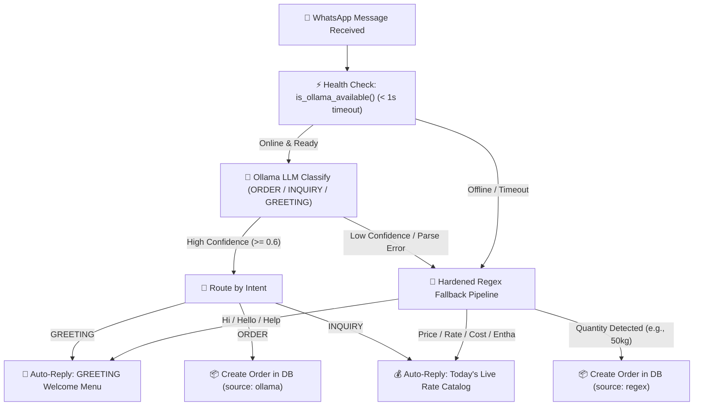

# 🐔 Go Chicken — Massive Comprehensive Project Walkthrough

**Date:** July 4, 2026  
**System Version:** v1.0.0 (Production-Ready Architecture)

---

## 1. Project Description & Vision

### 💡 The Core Problem
In the fast-moving poultry wholesale industry, "Main Bosses" (wholesalers) and retail chicken center owners operate under intense daily pressure:
- **Perishable Inventory & Dynamic Rates:** Poultry prices fluctuate daily based on market supply and mortality rates.
- **Chaotic Order Entry:** Retailers place orders via endless phone calls, voice notes, and informal text messages, leading to human error and lost revenue.
- **Manual Ledgers (Khata):** Tracking credit balances and payments across dozens of retail shops relies on physical paper notebooks.

### 🚀 The Solution
**Go Chicken** is an automated, AI-powered poultry supply chain and WhatsApp order management platform. It transforms unstructured WhatsApp messages from retailers into structured, automated business operations:
1. **Automated WhatsApp Bot:** Retailers send messages like *"50kg live bird"* or *"what is today's rate?"* directly to the wholesale WhatsApp number.
2. **Hybrid AI & Regex Intelligence:** The backend classifies intent using local Large Language Models (**Ollama**) with instant, hardened **Regex Fallbacks**, ensuring zero downtime even if AI models are offline.
3. **Real-Time Financials & Logistics:** Orders are logged into a PostgreSQL database, credit ledgers (Khata) are updated automatically, and logistics are tracked across fleet vehicles.
4. **Boss Control Tower:** A stunning Next.js web dashboard allows the Main Boss to monitor live orders, update poultry rates with a single click, and analyze demand clusters.

---

## 2. What Has Been Built (Core Architecture & Features)

### 🧱 Backend Infrastructure (FastAPI & Docker PostgreSQL)
- **Containerized Database (`localhost:5435`):** Managed via Docker Compose running `pgvector/pgvector:pg16`, enabling relational data storage and vector similarity embeddings.
- **Complete Relational Schema ([schema.sql](file:///d:/Go Chicken/schema.sql)):** Tables for `tenants`, `users`, `trucks`, `iot_readings`, `orders`, `khata_transactions`, `ai_forecasts`, `error_logs`, `classification_logs`, `product_prices`, and `inventory`.
- **Asynchronous REST API ([main.py](file:///d:/Go Chicken/backend/main.py)):** Built with FastAPI, featuring modular routers for orders, pricing, analytics, and WhatsApp webhooks.
- **Startup Auto-Migrations:** The FastAPI startup event automatically verifies database tables and performs schema migrations (e.g., executing `ALTER TABLE orders ADD COLUMN IF NOT EXISTS phone_number VARCHAR(20)`), while ensuring all SQLAlchemy ORM models ([models/__init__.py](file:///d:/Go Chicken/backend/models/__init__.py)) are attached to metadata.
- **Dynamic Pricing Engine ([pricing.py](file:///d:/Go Chicken/backend/routers/pricing.py)):** Dedicated CRUD endpoints allowing instant rate updates for *Live Bird*, *Dressed*, and *Skinless* chicken without server restarts.

### 📱 WhatsApp Automation & AI Classification Pipeline
- **Native Meta Cloud API Handler ([whatsapp.py](file:///d:/Go Chicken/backend/routers/whatsapp.py)):** Replaced third-party automation tools (n8n) with a high-performance FastAPI webhook router. Supports both `/whatsapp/webhook` and trailing slash `/whatsapp/webhook/` alias routes to prevent 307 redirects during Meta verification.
- **Asynchronous Webhook Processing:** Implemented `BackgroundTasks` to immediately return `200 OK` to Meta within milliseconds while executing complex classification and database inserts in the background.



- **Fast-Fail AI Guardrail ([ollama_client.py](file:///d:/Go Chicken/backend/core/ollama_client.py)):** Added a lightweight `< 1.0s` health check against `/api/tags`. If Ollama is not running or unreachable, the system instantly bypasses LLM inference and routes to regex, avoiding 30-second socket timeouts.
- **Regex Greeting & Inquiry Fallback:** Enhanced regular expressions to identify greetings (`hi`, `hello`, `vanakkam`) and pricing queries (`price`, `rate entha`), ensuring the bot provides instant, professional replies even without AI.
- **Outbound WhatsApp Messenger:** Integrates directly with Meta Graph API (`v21.0`) to transmit formatted price lists, usage instructions, and order confirmations back to retailers.

### 📊 Wholesaler Web Dashboard (Next.js & Tailwind CSS)
- **Executive UI ([page.js](file:///d:/Go Chicken/frontend/src/app/page.js)):** A modern, dark-mode inspired single-page interface built with React 19 and Next.js App Router.
- **Interactive Financials & Ledgers:** Features live clock synchronization, instant Khata payment recording modals, status toggles, and live text filtering across retailers and fleet vehicles.
- **Live Pricing Control Tower:** Interactive admin controls integrated directly into the dashboard header. Modifying rates here updates backend storage immediately, which is reflected in the next WhatsApp rate inquiry.
- **Dynamic Fleet Management:** Replaced static map placeholders with a full CRUD data table tracking truck drivers, status, and dynamically summing total fleet capacity.

### ☁️ Netlify Monorepo Deployment Setup
- **Cloud-Ready Configuration:** Engineered [netlify.toml](file:///d:/Go Chicken/netlify.toml) in the root directory and inside [frontend/netlify.toml](file:///d:/Go Chicken/frontend/netlify.toml) to configure `base = "frontend"`, `command = "npm run build"`, and automatically invoke `@netlify/plugin-nextjs`, eliminating cloud `404 Not Found` deployment errors.

---

## 3. What's Broken / Current Gotchas ⚠️

The following table details known runtime constraints, external API behaviors, and temporary bottlenecks encountered during development:

| Component | Error / Symptom | Root Cause & Resolution |
|---|---|---|
| **Meta WhatsApp Outbound Replies** | `HTTP 400 Bad Request (#131030)`<br>`"Recipient phone number not in allowed list"` | **Cause:** When using a Meta Cloud API **Test Business Account**, Meta strictly blocks outbound messages to any phone number that has not been explicitly authorized.<br>**Resolution:** Go to *Meta Developers Dashboard -> WhatsApp -> API Setup*, click **Manage Phone Number List**, add the recipient's phone number, and verify it with the 5-digit OTP sent by Meta. |
| **Meta Webhook Message Delivery** | Webhook URL is verified, but sending messages from phone does not trigger server logs | **Cause:** Webhook subscription is incomplete in the Meta App settings.<br>**Resolution:** In the Meta Dashboard under *Webhooks -> Webhook fields*, locate the **`messages`** row and click **Subscribe**. |
| **Local LLM Cold-Start Latency** | First AI inference takes 15–30s on local CPU | **Cause:** Loading model weights (`llama3`, `mistral`) into system memory on initial request consumes CPU cycles.<br>**Resolution:** Mitigated by our fast-fail health check (`< 1.0s`). If immediate < 1s responses are required during development, Ollama can be disabled in `.env` to rely 100% on instant regex fallbacks. |
| **Frontend API Coupling** | UI components currently display mock data arrays by default | **Cause:** While the backend endpoints are functional and tested, the Next.js frontend state currently initializes from `MOCK_ORDERS` and `MOCK_TRUCKS` for immediate UI previewing.<br>**Resolution:** Need to wire up React `useEffect` / TanStack Query hooks to fetch live from `http://localhost:8001/api/v1`. |
| **Windows Socket Binding (`Errno 10048`)** | `Only one usage of each socket address is normally permitted` | **Cause:** When restarting uvicorn servers on Windows, previous Python sub-processes may remain alive holding ports 8000/8001.<br>**Resolution:** Run PowerShell command: `Stop-Process -Id (Get-NetTCPConnection -LocalPort 8000,8001).OwningProcess -Force`. |

---

## 4. What Is Incomplete / Next Steps 🚀

Here is the prioritized technical roadmap to take the codebase from production-ready beta to full commercial deployment:

| Milestone / Feature | Description | Priority | Effort |
|---|---|---|---|
| **1. Frontend Live API Wiring** | Replace frontend static state initialized from `MOCK_ORDERS` / `MOCK_TRUCKS` with asynchronous `fetch()` calls to backend endpoints (`/api/v1/orders`, `/api/v1/pricing`, `/api/v1/trucks`). Implement optimistic UI updates on status toggles. | **HIGH** | 2 Hours |
| **2. AI Forecasting Pipeline Integration** | Connect the local Ollama LLM to analyze historical order patterns from PostgreSQL and generate natural language reasoning for the AI Demand Forecast component. | **MEDIUM** | 3 Hours |
| **3. pgvector Similarity Clustering** | Use `nomic-embed-text` to generate vector embeddings of retailer order histories and store them in `pgvector`. Query cosine distances to dynamically cluster retailers in the Recharts scatter plot. | **MEDIUM** | 4 Hours |
| **4. WhatsApp Order Confirmation Flow** | Enhance `_handle_text_message` in `whatsapp.py` to send an interactive WhatsApp confirmation button or detailed bill summary with Khata balance after an order is inserted into the DB. | **MEDIUM** | 2 Hours |
| **5. Production Domain & SSL Setup** | Transition from local ngrok tunnels to a production cloud server (AWS / DigitalOcean / Hetzner) using Nginx or Caddy as a reverse proxy with automated Let's Encrypt SSL certificates and Docker Secrets. | **LOW** | 3 Hours |
| **6. Comprehensive E2E Testing** | Expand current unit test suite (`38 tests passing`) with Playwright frontend tests and automated webhook simulation scripts. | **LOW** | 3 Hours |

---

## 5. Quick Start Verification Guide

To spin up the entire stack locally and verify functionality:

```powershell
# 1. Start PostgreSQL with pgvector (Port 5435)
docker-compose up -d

# 2. Start FastAPI Backend (Port 8001)
cd backend
python -m uvicorn main:app --port 8001 --host 0.0.0.0

# 3. Start Next.js Frontend (Port 3000)
cd ../frontend
npm run dev
```

- **Dashboard UI:** Open `http://localhost:3000`
- **Backend API Docs:** Open `http://localhost:8001/docs`
- **Test Webhook Locally:**
```powershell
python -c "import urllib.request, json; data = json.dumps({'object': 'whatsapp_business_account', 'entry': [{'id': '12345', 'changes': [{'value': {'messaging_product': 'whatsapp', 'metadata': {'display_phone_number': '15556057759', 'phone_number_id': '1217164488146788'}, 'messages': [{'from': '15551234567', 'id': 'wamid.test', 'timestamp': '1678900000', 'text': {'body': 'Hi'}, 'type': 'text'}]}, 'field': 'messages'}]}]}).encode('utf-8'); req = urllib.request.Request('http://127.0.0.1:8001/whatsapp/webhook', data=data, headers={'Content-Type': 'application/json'}); print(urllib.request.urlopen(req).read().decode())"
```
